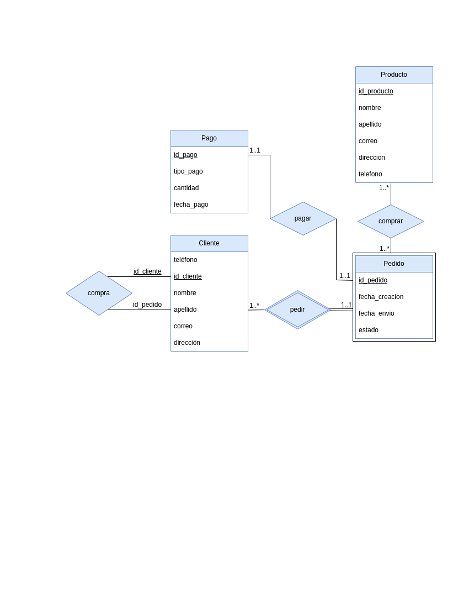

# Database Design Using the E-R Model

# Modelo

Para este proyecto hemos creado un modelo entidad relacion para una tienda Tendrá las siguientes entidades: 

1. Cliente
2. Producto
3. Pedido
4. Pago

Cada una de estas entidades tendrá sus propios atributos y claves principales. Además, habrá relaciones entre estas entidades que tendrán sus propios atributos y roles en relaciones recursivas.

La entidad Cliente tendrá los siguientes atributos: 
- id (clave principal)
- nombre
- apellido
- correo electrónico
- dirección
- número de teléfono

La entidad Producto tendrá los siguientes atributos: 
- id (clave principal)
- nombre
- descripción
- precio
- cantidad en stock

La entidad Pedido tendrá los siguientes atributos: 
- id (clave principal)
- fecha de creación
- fecha de envío
- estado de la pedido

# Relaciones

La entidad Pago tendrá los siguientes atributos: 
- id (clave principal)
- método de pago
- monto
- fecha de pago

La relación entre el Cliente y Pedido será de uno a muchos, ya que un cliente puede hacer varios pedidos. La relación tendrá los siguientes atributos: 
- id del cliente (clave foránea)
- id de la pedido (clave foránea)
- fecha de creación
- fecha de envío
- estado de la pedido

La relación entre Pedido y el Producto será de muchos a muchos, ya que una pedido puede tener varios productos y un producto puede estar en varios pedidos. La relación tendrá los siguientes atributos:
- id de la pedido (clave foránea)
- id del producto (clave foránea)
- cantidad

La relación entre el pedido y el pago será de uno a uno, ya que un pedido tiene un solo pago. La relación tendrá los siguientes atributos:
- id de la pedido (clave foránea)
- id del pago (clave foránea)
