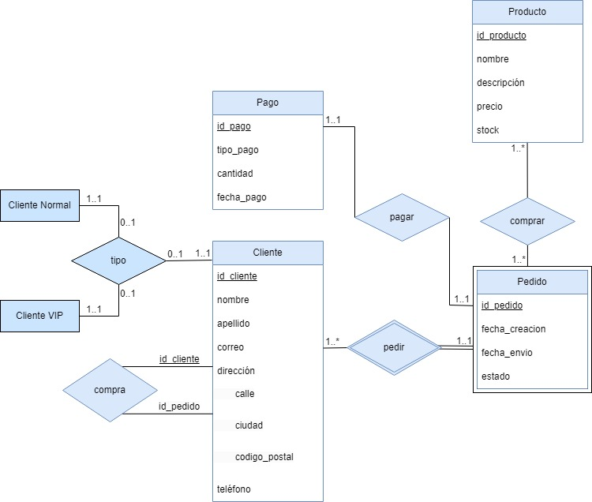

# Diseño de bases de datos mediante el modelo E-R



## Modelo

Para este proyecto hemos creado un modelo entidad relación para una tienda, este modelo lo hemos dividido en cuatro entidades:

* Cliente
* Producto
* Pedido
* Pago

Cada una de estas entidades tendrá sus propios atributos y claves principales (Primary Key). Además, habrá relaciones entre estas entidades que tendrán sus propios atributos y roles en relaciones recursivas. Para ello hemos dividido las cuatro entidades con los siguientes atributos:

**Entidad Cliente**
```
- id (Clave Principal)
- nombre
- apellido
- correo
- dirección
- teléfono
```

**Entidad Producto**
```
- id (Clave Principal)
- nombre
- descripción
- precio
- stock
```

**Entidad Pedido**
```
- id (Clave Principal)
- fecha_creacion
- fecha_envio
- estado
```

**Entidad Pago**
```
- id (Clave Principal)
- tipo_pago
- cantidad
- fecha_pago
```


## Relaciones

Una vez asignado los atributos a cada entidad, hemos realizado las siguientes relaciones:

**Entidad Pago con Entidad Pedido**
```
- pagar
```

**Entidad Cliente con Entidad Pedido**
```
- pedir
```

**Entre Pedido con Entidad Producto**
```
- comprar
```

## Relación Cardinal

Para las relaciones establecidas, hemos distribuido cada relación con las siguientes restricciones cardinales:

```
Pago 1..1:1..1 pagar | pagar 1..1:1..1 Pedido
Producto 1..*:1..* comprar | comprar 1..*:1..* Pedido
Pedido 1..1:1..* pedir | pedir 1..*:1..* Cliente
```

## Entidades Débiles

En este diseño podemos encontrar también una entidad débil entre Pedido y Cliente, como se puede visualizar en "pedir"
